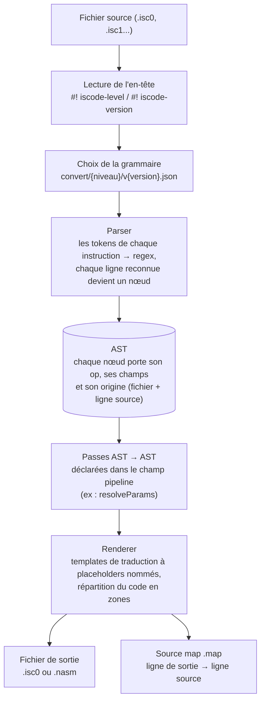
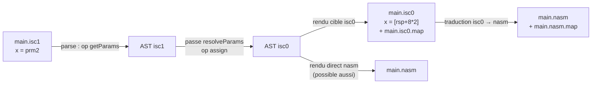
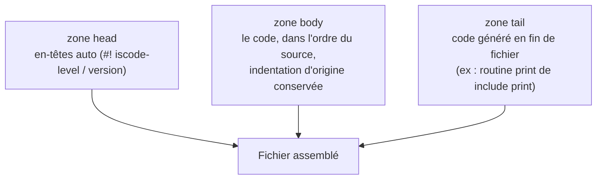

# ISCode Support 0.3.2

ISCode est un langage de programmation simplifié, pensé comme un "Python/Scratch vers l'assembleur" : on écrit du code simple et lisible, et l'extension le traduit en NASM x86/x64. Le langage est organisé en **niveaux** (`isc1`, le plus haut niveau, se traduit en `isc0`, qui se traduit en assembleur), et chaque niveau est défini **uniquement en JSON** — pas besoin de toucher au code pour ajouter une instruction.

## Translate
Open your ISCode file
Press CTRL+SHIFT+P and type :
```
ISCode : Translate code
```
And press ENTER
Select the output format and wait

Deux fichiers sont produits à côté du fichier source :
- la **traduction** (`main.nasm`, `main.isc0`...) — les fichiers générés de niveau ISCode contiennent leur en-tête de version et sont donc re-traduisibles tels quels ;
- une **source map** (`main.nasm.map`, `main.isc0.map`) qui trace chaque ligne de sortie vers sa ligne d'origine.

## Tester la conversion (exemple depuis un nouveau dossier)

```bash
# 1. Récupérer et préparer le projet
git clone https://github.com/ProfesseurIssou/iscode iscode-test
cd iscode-test
npm install
npm run compile

# 2. Test automatisé du pipeline (parse -> passes -> rendu sur les samples)
npm run test:pipeline

# 3. Traduire les exemples en ligne de commande
npm run translate -- samples/main.isc0 nasm_x86_x64   # isc0 -> nasm
npm run translate -- samples/main.isc1                # isc1 -> isc0
```

Résultats attendus dans `samples/` :
- `main.nasm` : le NASM, avec la routine `print:` générée en fin de fichier ;
- `main.isc0` : le `main.isc1` descendu d'un niveau, avec son en-tête — il est donc re-traduisible : `npm run translate -- samples/main.isc0 nasm_x86_x64` ;
- les source maps `.map` à côté de chaque sortie.

Pour vos propres fichiers : `npm run translate -- chemin/vers/monfichier.isc1`. Sans cible et si plusieurs cibles existent, la liste des cibles est affichée.

**Étape 4 — tester l'extension réelle dans VS Code** : appuyez sur **F5** (configuration « Run Extension »), ouvrez un `.isc0` dans la fenêtre qui s'ouvre, puis utilisez le bouton **ISCode : Translate** de la barre de statut. C'est le seul test qui couvre l'interface (QuickPick, autocomplétion, messages).

### Exemple : afficher une chaîne en isc0

```
#! iscode-level: isc0
#! iscode-version: 1

mode 64
global main

CONST:
byte msg 'Hello'

CODE:
func main
  include print
  print msg
  rax = 60
  rdi = 0
  syscall 0x80
```

`include print` (une seule fois) injecte la routine d'affichage en fin de fichier ; `print msg` place l'adresse de la chaîne dans `rsi` et appelle `print`. Le fichier `.nasm` produit :

```asm
main:
  mov rsi,msg
  call print
  mov rax,60
  mov rdi,0
  int 0x80

print:
    push rdx
    ...
```

## Architecture

### Flux de traduction global



### Cascade des niveaux

Chaque niveau se traduit vers le niveau inférieur ; les passes font le travail qui ne peut pas être une simple substitution ligne à ligne, et les source maps conservent la traçabilité à chaque étape.



### Zones de sortie

Le rendu ne se limite plus à une ligne de sortie par ligne source : chaque instruction (ou passe) peut écrire dans des **zones** nommées, assemblées dans l'ordre `renderZoneOrder`. C'est ce qui permet de générer du code en haut ou en bas du fichier.



## Versions de langage et en-tête de source

Les grammaires sont versionnées : `convert/<niveau>/v<version>.json` (ex : `convert/isc0/v1.json`). Un fichier source déclare ce qu'il est avec des meta-lignes en tête :

```
#! iscode-level: isc1
#! iscode-version: 1
```

- Sans en-tête, le niveau est déduit de l'extension du fichier et la version la plus récente est utilisée (les vieux fichiers restent donc traduisibles).
- Avec une version inconnue, l'extension traduit avec la version la plus récente et affiche un avertissement.
- Les lignes commençant par `#!` sont ignorées par le parser, partout dans le fichier.

## Create or Add my own translation
1. Press CTRL+SHIFT+P and type :
```
ISCode : Open translate folder
```
2. And press ENTER

#### Import a translation :
3. Drag and drop the translation folder into `convert/` (as `convert/<niveau>/v<version>.json`)
<br>

#### Create my translation :
3. Make a new folder + file in JSON format : `convert/{fileExtension}/v1.json`

    ##### Example:
    "***convert/testCode/v1.json***" are selected when the current file format is "####.***testCode***"
<br>
4. Copy paste the next json pattern and define your language :

```JSON
{
    "name": "{{FormatExtension}}",
    "version": 1,
    "renderZoneOrder": ["head", "body", "tail"],
    "pipeline": [],
    "availableTranslation": {
        "{{OutputFormatName}}": { "extension": "{{OutputFileExtension}}" }
    },
    "tokens": {
        "{{ExprName1}}": "{{REGEX1}}",
        "{{ExprName2}}": "{{REGEX2}}"
    },
    "instructions": {
        "{{InstructionName1}}": {
            "syntax": ["{{ExprName1}}"],
            "ast": { "op": "{{OpName}}", "{{champ}}": "%{1}" },
            "snippet": {
                "output": "{{Autocompletion}}",
                "documentation": "{{InstructionDocumentation}}",
                "commitChars": null
            },
            "translation": {
                "{{OutputFormatName}}": [
                    { "zone": "body", "line": "{{CODE WITH %{champ} PLACEHOLDERS}}" }
                ]
            }
        }
    }
}
```

##### Exemple :

```JSON
{
    "name": "isc0",
    "version": 1,
    "renderZoneOrder": ["head", "body", "tail"],
    "pipeline": [],
    "availableTranslation": {
        "isc0": { "extension": "isc0", "emitHeader": true },
        "nasm_x86_x64": { "extension": "nasm" }
    },
    "tokens": {
        "indentation": "^[ ]{0,}",
        "space": "[ ]{1,}",
        "numbers": "[0-9]{1,}",
        "communData": "[a-zA-Z0-9_\\[\\]\\-\\+\\*\\$']{1,}",
        "InstMode": "mode",
        "InstEgal": "="
    },
    "instructions": {
        "architectureMode": {
            "syntax": ["indentation", "InstMode", "space", "numbers"],
            "ast": { "op": "mode", "bits": "%{4}" },
            "snippet": {
                "output": "mode ${1|8,16,32,64|}",
                "documentation": "Set architecture mode",
                "commitChars": ["."]
            },
            "translation": {
                "isc0": [ { "zone": "body", "line": "mode %{bits}" } ],
                "nasm_x86_x64": [ { "zone": "body", "line": "bits %{bits}" } ]
            }
        },
        "assign": {
            "syntax": ["indentation", "communData", "space", "InstEgal", "space", "communData"],
            "ast": { "op": "assign", "dst": "%{2}", "src": "%{6}" },
            "snippet": {
                "output": "${1} = ${2}",
                "documentation": "Assign a register with value",
                "commitChars": null
            },
            "translation": {
                "isc0": [ { "zone": "body", "line": "%{dst} = %{src}" } ],
                "nasm_x86_x64": [ { "zone": "body", "line": "mov %{dst},%{src}" } ]
            }
        }
    }
}
```

### Comment ça marche, champ par champ

- **`tokens`** : des morceaux de regex nommés, réutilisables dans les syntaxes.
- **`syntax`** : la liste ordonnée des tokens qui composent l'instruction. Chaque token devient un groupe de capture : `%{1}`, `%{2}`... dans le template `ast` y réfèrent. La première instruction dont la regex matche la ligne gagne.
- **`ast`** : le nœud d'AST produit par la ligne. Les valeurs passent par les placeholders `%{n}` (captures). Le nœud reçoit automatiquement son `origin` (fichier + ligne) — c'est ce qui alimente les source maps.
- **`translation`** : pour chaque cible de rendu, une liste d'entrées `{ "zone", "line" }`. Une entrée peut émettre plusieurs lignes (`"line": ["a", "b"]`). Les placeholders y sont **nommés** d'après les champs de l'ast (`%{dst}`, `%{src}`...). En zone `body`, l'indentation d'origine du nœud est réappliquée automatiquement.
- **`availableTranslation`** : les formats de sortie proposés dans le menu. `extension` = extension du fichier produit ; `grammar` + `target` = rendre avec une autre grammaire (ex : un fichier isc1 rendu comme du isc0) ; `emitHeader` = ajouter l'en-tête de version au fichier généré.
- **`pipeline`** : les passes AST→AST appliquées avant rendu (ex : `"pipeline": ["resolveParams"]`). Les passes sont du code TypeScript (`src/passes.ts`), référencées par nom.
- **`renderZoneOrder`** : l'ordre d'assemblage des zones dans le fichier final.
- **`target`** (haut niveau) : le niveau attendu par le fichier produit (ex : isc1 produit du isc0 v1).

### Source maps

À chaque traduction, un fichier `.map` JSON est écrit à côté de la sortie :

```JSON
{
    "7": { "file": "main.isc0", "level": "isc0", "version": 1, "line": 9 },
    "16": { "file": "main.isc0", "level": "isc0", "version": 1, "line": 18 },
    "21": { "file": "main.isc0", "level": "isc0", "version": 1, "line": 17 }
}
```

**Pourquoi ligne par ligne ?** Ce n'est pas une info de langage (un fichier est bien entièrement dans un seul niveau : c'est l'en-tête et le nom de la grammaire qui le disent), c'est de la **traçabilité** : la map répond à « de quelle ligne source vient chaque ligne de sortie ». C'est indispensable dès que le code généré se décale : `include print` (une ligne source) produit 12 lignes de NASM en fin de fichier, `print msg` en produit 2, les passes réécrivent des lignes. La ligne 7 de la sortie (`msg db 'Hello'`) vient de la ligne 9 du source, la ligne 16 (`call print`) du `print msg` en ligne 18, et toute la routine `print:` (ligne 21 et suivantes) du `include print` en ligne 17.

Concrètement, ça sert à : retrouver la ligne de votre code responsable d'une erreur NASM (NASM donne une ligne du `.nasm`, la map la ramène à la vôtre) ; à la navigation dans une future UI (erreur cliquable → saut vers la ligne source) ; et la traçabilité traverse toute la cascade isc1 → isc0 → nasm puisque chaque nœud généré hérite de l'origine de sa ligne source.

## Développement

```bash
npm install
npm run compile       # compilation TypeScript
npm run test:pipeline # tests du pipeline (parse → passes → rendu), sans vscode
npm run watch         # compilation continue
```

La traduction en ligne de commande (`npm run translate`) et l'exemple complet de test sont détaillés dans la section [Tester la conversion](#tester-la-conversion-exemple-depuis-un-nouveau-dossier). Exemples de fichiers source et sorties attendues : `samples/` (testés par `test:pipeline`).
